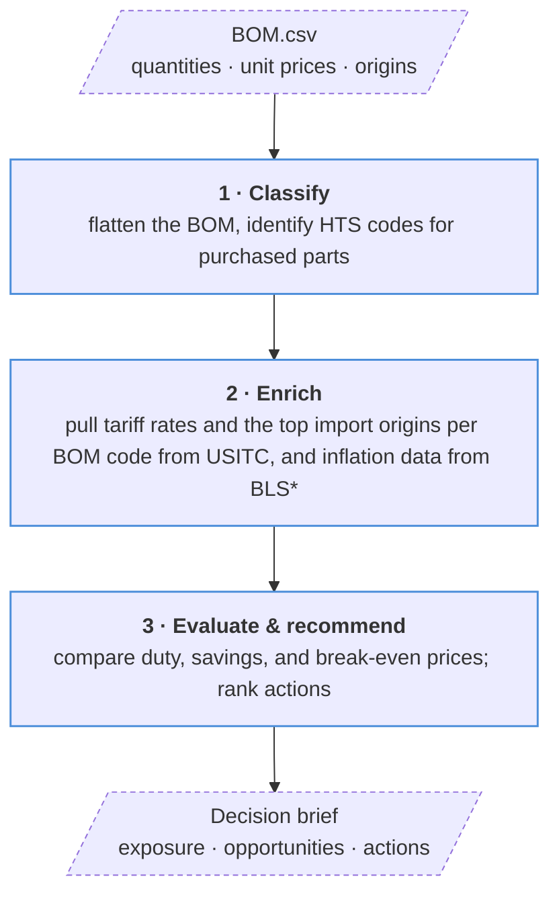

# BOM Tariff Exposure Agent


[](pyproject.toml)
[](LICENSE)
[](https://platform.openai.com/)
[](https://dataweb.usitc.gov/)

Connect your product’s BOM and purchase costs with tariff rates and import data
to quantify cost pressure, pinpoint exposed parts, and identify sourcing actions
that protect margin. Compare origins, estimate savings, and set purchase-price
targets in a clear decision brief.

## Workflow



Import origins are ranked by U.S. customs value in USD over the last 12 complete
months. Python calculates duty and savings; the model classifies parts and writes
the brief.

\*Tariff and import data are real from USITC databweb real time endpoints. BLS endpoint is currently sythentic.

## Run

Requires Python 3.11+, the project dependencies, and `OPENAI_API_KEY` and
`DATAWEB_API_KEY` in `.env` or your shell. With the existing environment:

```bash
.venv/bin/python -m src.run --bom examples/two_parts.csv --out out/two_parts
```

Defaults: `--bom BOM.csv`, `--out out`. For the interactive terminal, install the
optional TUI extra and launch:

```bash
uv pip install --python .venv/bin/python -e '.[tui]'
.venv/bin/python -m src.tui --bom examples/two_parts.csv --out out/two_parts
```

## Input and outputs

BOM source: [Mekanika EVO-M V1.0 bill of materials](https://github.com/mekanika-dev/evo/blob/main/bom/EVO-M%20V1.0.csv).

BOM CSV columns (see [example](examples/20_parts.csv)):

```text
level,component_reference,component_name,component_quantity,parent_bom_reference,has_child_bom,unit_price_usd,country_of_origin
```

Quantities are per finished product. Repeated references must share a unit price
and origin; the assembly root must reconcile with total purchased-part value.

- **Decision:** `brief.md` and `brief_data.json` — exposure, coverage, sourcing opportunities, and actions.
- **Comparisons:** `scenarios.jsonl` and `trade_countries.jsonl` — duty by origin and import rankings.
- **Trace:** `components.csv`, `classified.csv`, and `token_usage.json` — parts, classifications, and API usage.

## Cost pressure calculation

```text
Component baseline spend = Component quantity × Component unit price
Component index change = Current component index / Baseline component index − 1
Index-implied cost pressure = Σ (Component baseline spend × Component index change)
Weighted index change (%) = 100 × Index-implied cost pressure / Σ Component baseline spend
```

Quantity is per finished product; unit price and spend are in USD. Index change
measures movement from the baseline period. Cost pressure estimates the dollar
impact; weighted index change expresses it as a percentage of baseline spend.

- **Baseline component index:** the price index value assigned to a component
  for the starting comparison period.
- **Current component index:** the value of the same price index for the period
  being evaluated. Comparing it with the baseline measures benchmark price
  movement for that component.

These are index levels, not dollar prices. For example, a baseline of 110.0 and
a current value of 117.4 imply a 6.73% increase (`117.4 / 110.0 − 1`). The current
implementation assigns fixed mock values by component reference; it does not
fetch real BLS series or associate the values with actual dates.

Sums include purchased components with valid spend and index data, counted once
within each assembly or product. Cost pressure is `N/A` without valid data;
weighted change is `N/A` when baseline spend is zero. Indices are currently
mocked benchmarks, not observed supplier price changes.
