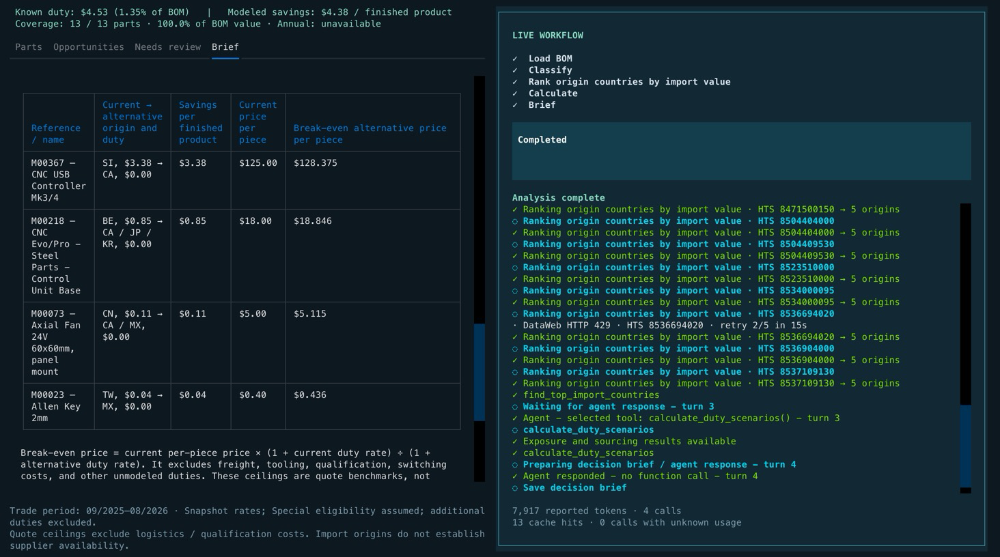
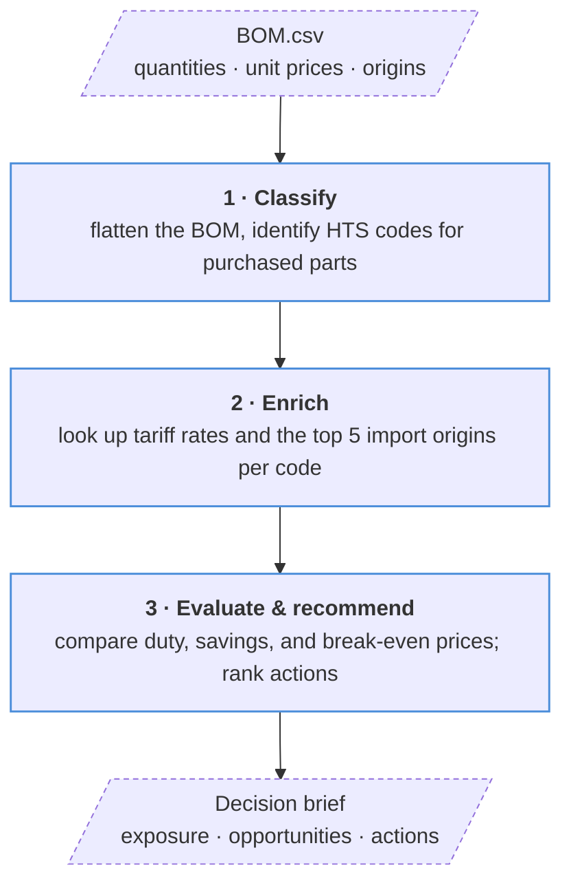

# BOM Tariff Exposure Agent



[](pyproject.toml)
[](LICENSE)
[](https://platform.openai.com/)
[](https://dataweb.usitc.gov/)

Connect your product’s BOM and purchase costs with tariff rates and import data
to quantify cost pressure, pinpoint exposed parts, and identify sourcing actions
that protect margin. Compare origins, estimate savings, and set purchase-price
targets in a clear decision brief.

## Workflow



Import origins are ranked by U.S. customs value in USD over the last 12 complete
months. Python calculates duty and savings; the model classifies parts and writes
the brief.

## Run

Requires Python 3.11+, the project dependencies, and `OPENAI_API_KEY` and
`DATAWEB_API_KEY` in `.env` or your shell. With the existing environment:

```bash
.venv/bin/python -m src.run --bom examples/two_parts.csv --out out/two_parts
```

Defaults: `--bom BOM.csv`, `--out out`. For the interactive terminal, install the
optional TUI extra and launch:

```bash
uv pip install --python .venv/bin/python -e '.[tui]'
.venv/bin/python -m src.tui --bom examples/two_parts.csv --out out/two_parts
```

## Input and outputs

BOM CSV columns (see [example](examples/two_parts.csv)):

```text
level,component_reference,component_name,component_quantity,parent_bom_reference,has_child_bom,unit_price_usd,country_of_origin
```

Quantities are per finished product. Repeated references must share a unit price
and origin; the assembly root must reconcile with total purchased-part value.

- **Decision:** `brief.md` and `brief_data.json` — exposure, coverage, sourcing opportunities, and actions.
- **Comparisons:** `scenarios.jsonl` and `trade_countries.jsonl` — duty by origin and import rankings.
- **Trace:** `components.csv`, `classified.csv`, and `token_usage.json` — parts, classifications, and API usage.

## Scope

The bundled `htsdata.json` covers heading **7318**. Estimates use General and
supported Special rates, assuming program eligibility; Chapter 99, Column 2,
and additional duties are excluded. Unsupported classifications or rates are
flagged for review.

Amounts are USD per finished product, assuming parts are imported separately at
unchanged BOM prices. Savings and quote ceilings exclude freight, tooling,
switching costs, and unmodeled duties; they are estimates, not supplier offers
or verified total import duties.
