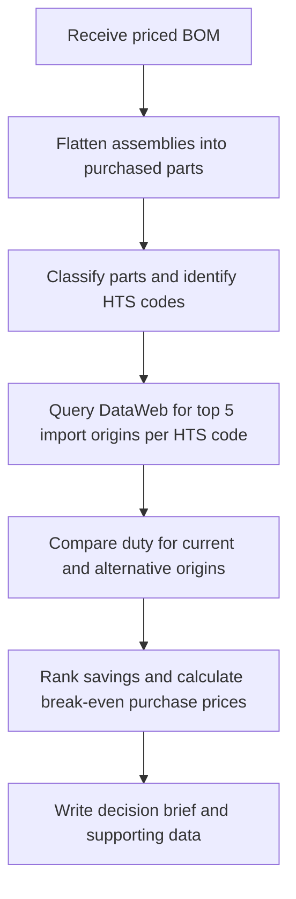

# BOM Tariff Exposure Agent

Turn a priced bill of materials (BOM) into HTS duty estimates, sourcing comparisons,
and a decision brief with modeled savings and break-even purchase prices.

## Workflow



Classification uses an LLM and caches validated selections. DataWeb ranks origins
by U.S. import customs value in USD over the last 12 complete months—not physical
quantity. Python calculates duty and savings; the model writes the brief.

## Run

Requires Python 3.11+, the project dependencies, and `OPENAI_API_KEY` and
`DATAWEB_API_KEY` in `.env` or your shell. With the existing environment:

```bash
.venv/bin/python -m src.run --bom examples/two_parts.csv --out out/two_parts
```

Defaults: `--bom BOM.csv`, `--out out`. For the interactive terminal, install the
optional TUI extra and launch:

```bash
uv pip install --python .venv/bin/python -e '.[tui]'
.venv/bin/python -m src.tui --bom examples/two_parts.csv --out out/two_parts
```

## Input and outputs

BOM CSV columns (see [example](examples/two_parts.csv)):

```text
level,component_reference,component_name,component_quantity,parent_bom_reference,has_child_bom,unit_price_usd,country_of_origin
```

Quantities are per finished product. Repeated references must share a unit price
and origin; the assembly root must reconcile with total purchased-part value.

- **Decision:** `brief.md` and `brief_data.json` — exposure, coverage, sourcing opportunities, and actions.
- **Comparisons:** `scenarios.jsonl` and `trade_countries.jsonl` — duty by origin and import rankings.
- **Trace:** `components.csv`, `classified.csv`, and `token_usage.json` — parts, classifications, and API usage.

## Scope

The bundled `htsdata.json` covers heading **7318**. Estimates use General and
supported Special rates, assuming program eligibility; Chapter 99, Column 2,
and additional duties are excluded. Unsupported classifications or rates are
flagged for review.

Amounts are USD per finished product, assuming parts are imported separately at
unchanged BOM prices. Savings and quote ceilings exclude freight, tooling,
switching costs, and unmodeled duties; they are estimates, not supplier offers
or verified total import duties.
