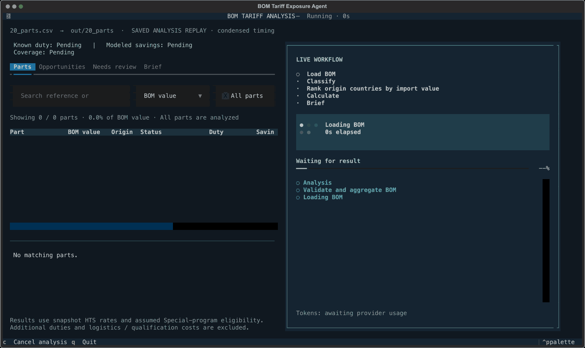
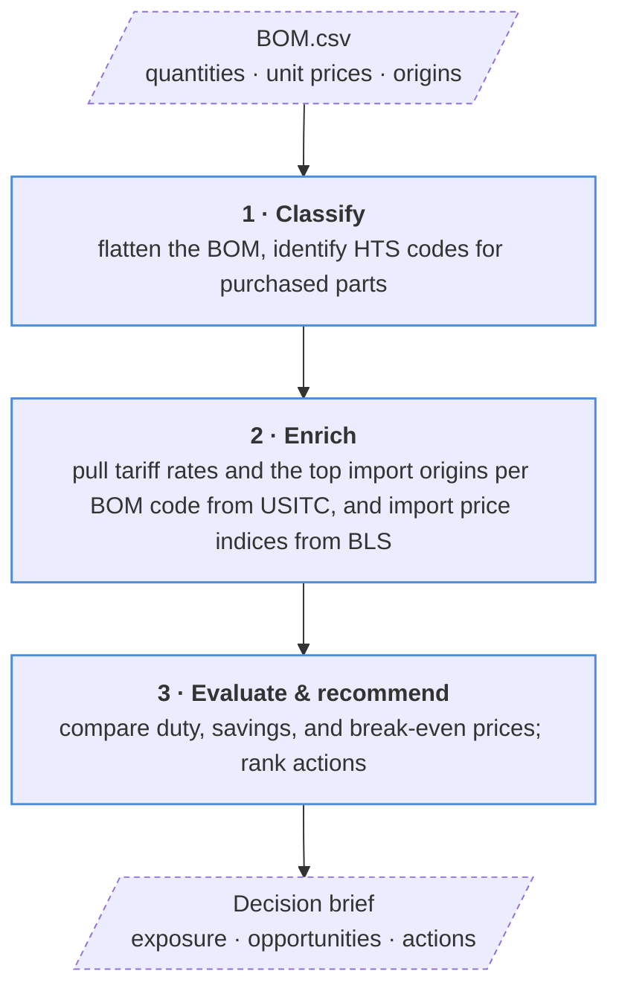

# BOM tariff & inflation analysis agent



[](pyproject.toml)
[](LICENSE)
[](https://platform.openai.com/)
[](https://dataweb.usitc.gov/)

A tariff & inflation analysis agent that maps each BOM part to HTS codes and
relevant BLS inflation indices to quantify cost pressure, identify alternative
sourcing countries with lower duties, and recommend pricing or surcharge actions
that protect margin.

- **Tariff and trade data ource:** [HTS](https://hts.usitc.gov/) and [USITC DataWeb](https://dataweb.usitc.gov/)
- **Inflation data source:** [Bureau of Labor Statistics (BLS)](https://www.bls.gov/)
- **BOM part → HTS code:** LLM-driven similarity matching
- **HTS code → BLS series ID:** Deterministic mapping rules

## Workflow



Import origins are ranked by U.S. customs value in USD over the last 12 complete
months. Python calculates duty and savings; the model classifies parts and writes
the brief.

Tariff rates use the HTS snapshot, import rankings use USITC DataWeb, and price & inflation
indices use the live BLS Public Data API.

## Run

Requires Python 3.11+, the project dependencies, and `OPENAI_API_KEY`,
`DATAWEB_API_KEY`, and `BLS_API_KEY` in `.env` or your shell. With the existing environment:

```bash
.venv/bin/python -m src.run --bom examples/two_parts.csv --out out/two_parts
```

The default BLS comparison is the latest available completed month across the
requested series versus the same month one year earlier. All components use
that same pair of months. To choose a comparison explicitly:

```bash
.venv/bin/python -m src.run --bom examples/two_parts.csv --out out/two_parts --bls-current-period 2026-07 --bls-baseline-period 2025-07
```

Defaults: `--bom BOM.csv`, `--out out`. For the interactive terminal, install the
optional TUI extra and launch:

```bash
uv pip install --python .venv/bin/python -e '.[tui]'
.venv/bin/python -m src.tui --bom examples/two_parts.csv --out out/two_parts
```

## Input and outputs

BOM source: [Mekanika EVO-M V1.0 bill of materials](https://github.com/mekanika-dev/evo/blob/main/bom/EVO-M%20V1.0.csv).

BOM CSV columns (see [example](examples/20_parts.csv)):

```text
level,component_reference,component_name,component_quantity,parent_bom_reference,has_child_bom,unit_price_usd,country_of_origin
```

Quantities are per finished product. Repeated references must share a unit price
and origin; the assembly root must reconcile with total purchased-part value.

- **Decision:** `brief.md` and `brief_data.json` — exposure, coverage, sourcing opportunities, and actions.
- **Comparisons:** `scenarios.jsonl` and `trade_countries.jsonl` — duty by origin and import rankings.
- **Trace:** `components.csv`, `classified.csv`, and `token_usage.json` — parts, classifications, and API usage.

## Cost pressure calculation

```text
Component baseline spend = Component quantity × Component unit price
Component index change = Current component index / Baseline component index − 1
Index-implied cost pressure = Σ (Component baseline spend × Component index change)
Weighted index change (%) = 100 × Index-implied cost pressure / Σ Component baseline spend
```

Quantity is per finished product; unit price and spend are in USD. Index change
measures movement from the baseline period. Cost pressure estimates the dollar
impact; weighted index change expresses it as a percentage of baseline spend.

- **Baseline component index:** the price index value assigned to a component
  for the starting comparison period.
- **Current component index:** the value of the same price index for the period
  being evaluated. Comparing it with the baseline measures benchmark price
  movement for that component.

These are index levels, not dollar prices. For example, a baseline of 110.0 and
a current value of 117.4 imply a 6.73% increase (`117.4 / 110.0 − 1`). Both
observations must come from the same BLS series and the selected comparison dates.

`calculate_cost_analysis()` orchestrates duty calculation and BLS enrichment,
then passes both results into `build_brief_data()`. BLS mapping, transport, and
enrichment live in `src/bls`; `src/cost_pressure.py` only calculates from supplied
data and performs no network calls.

The mapping follows the reference loader: read root `ei.series`, keep
`index_code == "IP"` and IDs matching `^EIUIP(?:\d{2}|\d{4})$`, then try the
HTS 4-digit heading before the 2-digit chapter. The loader retains its original
body, with a scoped pandas string option for compatibility with pandas 3.
Only series present in this catalog are eligible; refreshing `ei.series` is a
manual catalog update, separate from retrieving current observations.

If the heading lacks either observation, the chapter may supply both instead.
For example, the supplied `EIUIP8483` series begins in December 2025 and cannot
yet provide a year-over-year comparison. Missing data and lookup failures remain
unavailable; no synthetic values are substituted. API calls deduplicate series,
batch up to 50 per request, and retry transient failures up to three attempts.
Completed enrichment is reused within a run; observations are fetched afresh
on subsequent runs so BLS revisions can be reflected.

`brief_data.json` records each purchased row's benchmark category, series ID,
index values, dates, footnotes, and fallback or failure reasons under
`index_implied_cost_pressure.items[].benchmark`. The brief reports comparison
dates and index/spend coverage. These are broad import-market benchmarks, not
origin-specific or supplier-specific prices.

Sums include purchased components with valid spend and index data, counted once
within each assembly or product. Cost pressure is `N/A` without valid data;
weighted change is `N/A` when baseline spend is zero. Indices measure benchmark
movement, not observed supplier price changes.
